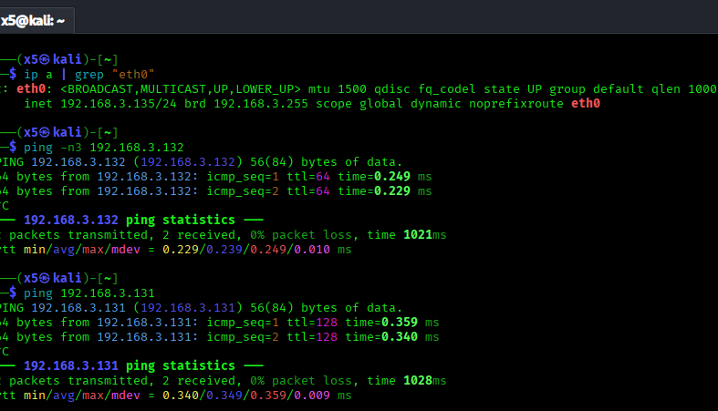
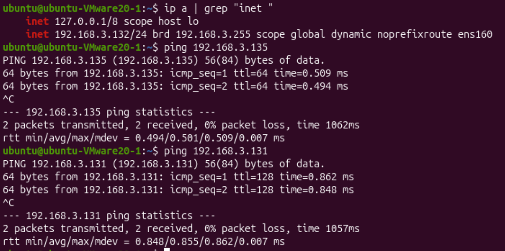
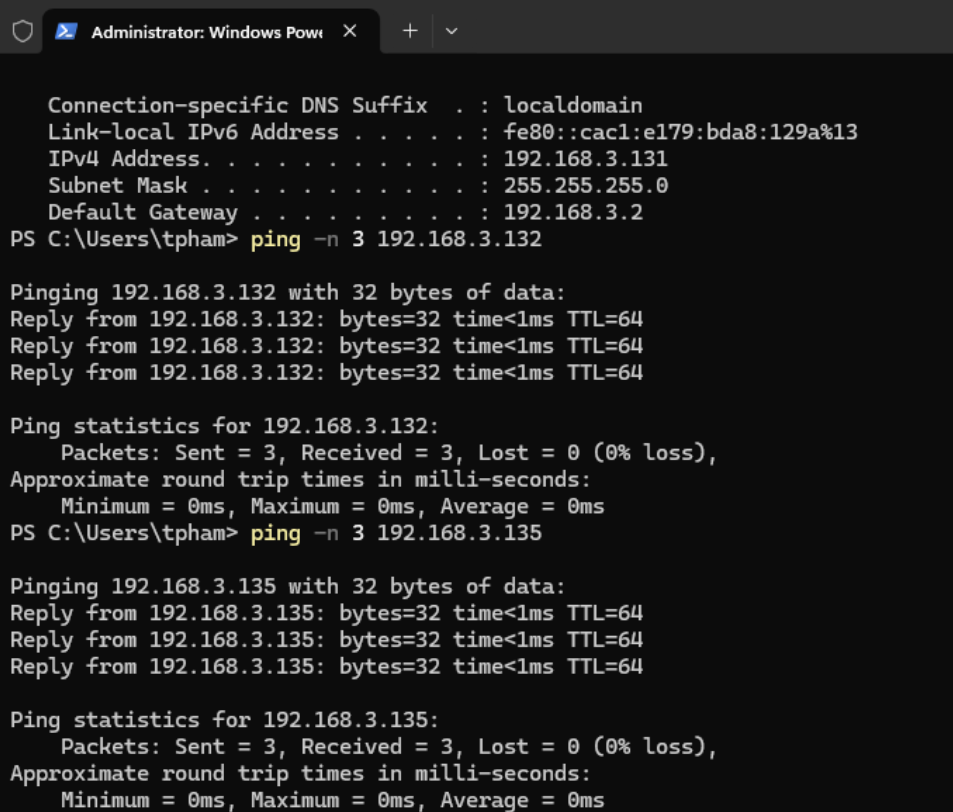

# Network Verification

Before deploying anything I wanted to be sure the three VMs could actually talk to
each other.

## Layout

| VM       | IP            | Role                  |
|----------|---------------|-----------------------|
| Windows  | 192.168.3.131 | monitored endpoint    |
| Ubuntu   | 192.168.3.132 | Wazuh server          |
| Kali     | 192.168.3.135 | attacker              |

All on VMware Fusion NAT, `192.168.3.0/24`, gateway `.2`. Same subnet, so they reach
each other and the internet.

## Two things that wasted my time

**Linux ping syntax.** `ping -n 3` is Windows. On Linux `-n` means "no DNS" and takes
no count, so the command just sat there and looked frozen. The right flag is `-c`:

```bash
ping -c 3 192.168.3.132
```

**Windows ignores ping by default.** Windows Firewall drops inbound ICMP echo on the
Public profile, so nothing could ping the Windows box until I allowed it:

```powershell
netsh advfirewall firewall add rule name="Allow ICMPv4-In" protocol=icmpv4:8,any dir=in action=allow
```

## Result

Once I used the right flags, every path was clean (0% loss) in both directions
between all three hosts. Windows replies came back with TTL 128, Linux with TTL 64,
which is a quick way to tell the two apart.

Cross-pings from each host:




