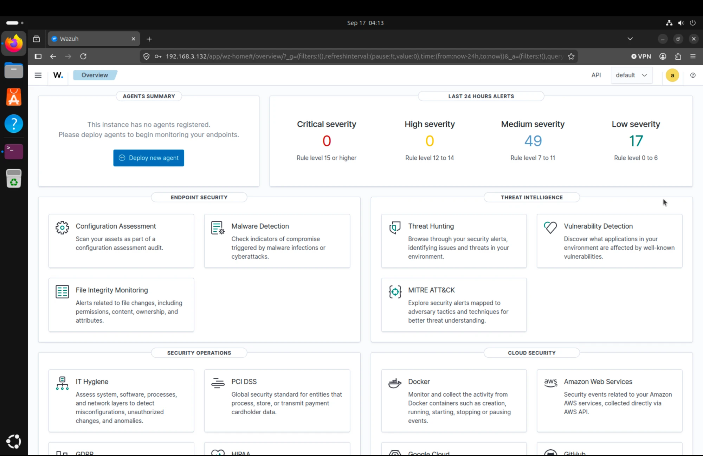

# Getting Wazuh running on Apple Silicon (ARM64)

Everything in this lab runs on an Apple Silicon Mac, so every VM is ARM64. That broke
the two quick-start paths Wazuh documents. Here's what failed and what finally worked.

## Try 1: the Docker single-node deploy

```bash
git clone https://github.com/wazuh/wazuh-docker.git -b v4.9.0
cd wazuh-docker/single-node
docker compose -f generate-indexer-certs.yml run --rm generator
docker compose up -d
```

All three containers went straight into a restart loop. The logs said:

```
wazuh.indexer-1  | exec /entrypoint.sh: exec format error
wazuh.manager-1  | exec /init: exec format error
```

`exec format error` means the CPU couldn't run the binary at all. Wazuh's images are
built for amd64 only, and this host had no emulation layer, so there was nothing to
translate the x86 instructions. Not a config problem, an architecture problem. Tore
it down with `docker compose down -v`.

## Try 2: the install script, 4.9

```bash
curl -sO https://packages.wazuh.com/4.9/wazuh-install.sh
sudo bash wazuh-install.sh -a -i
```

```
ERROR: Uncompatible system. This script must be run on a 64-bit system.
```

That check is wrong (aarch64 is 64-bit), but there was a second, real problem too:
Wazuh only publishes ARM64 packages for the indexer and dashboard from version 4.12
onward. On 4.9 those two components don't exist for ARM64, only the manager does. I
confirmed it against the repo:

```bash
curl -s https://packages.wazuh.com/4.x/apt/dists/stable/main/binary-arm64/Packages \
  | grep -E "wazuh-(indexer|dashboard|manager)"
```

## Try 3: the install script, 4.14

The newer assistant detects aarch64 and pulls ARM64 packages, and 4.14.7 has ARM64
builds of all three components:

```bash
curl -sO https://packages.wazuh.com/4.14/wazuh-install.sh
sudo bash wazuh-install.sh -a -i
```

Installed the indexer, manager, Filebeat, and dashboard natively. No emulation,
cluster came up green.



## What I'd tell the next person on Apple Silicon

- Skip the Wazuh Docker images. They're amd64 only.
- Use the 4.14 (or newer) install assistant.
- Component ARM64 support isn't uniform across versions, so check the package repo for
  your architecture before you pick a version.
